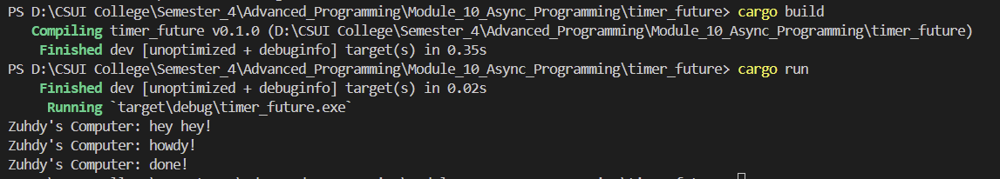
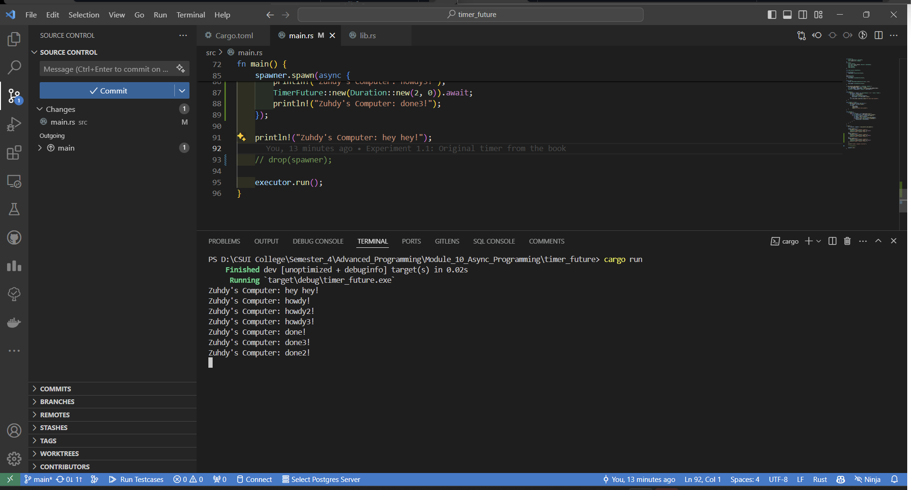
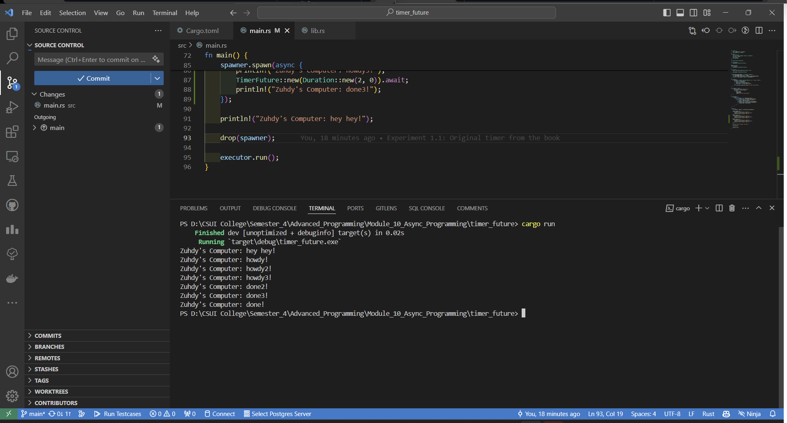

## Tutorial 1 Module 10

### 1.2 Understanding how it works

Pada gambar tersebut, terliath bahwa `println!("Zuhdy's Computer: hey hey!");` langsung dieksekusi langsung setelah spawner.spawn dipanggil. Jl ini menunjukkan bahwa statement tersebut bukan merupakan sebuah async, sehingga tidak perlu menunggu hasil dari async task untuk dieksekusi.

Sedangkan disisi lain, async block akan dijalankan secara async, tetapi menunggu `println!("Zuhdy's Computer: hey hey!");` selesai dieksekusi dikarenakan block tersebut dieksekusi secara langsung.

### 1.3 Multiple Spawn and removing drop

Ketika `drop(spawner);` dihapus, maka program akan terus berjalan tanpa menunggu task async selesai. Hal ini dikarenakan, program akan terus menunggu task yang dikirimkan pada ready_queue. Namun karena `spawner` masih hidup, maka akan terus mengirim tasks tanpa ada yang terselesaikan.

Sebaliknya, ketika `drop(spawner);` ada, maka program akan berjalan dan berhenti ketika `spwaner` dropped. Ini menunjukkan bahwa `spawner` berguna sebagai penanda bahwa ketika spawner dropped, maka tidak ada lagi task yang dikirim, sehingga `Executor` dapat melakukan tugasnya.